# Architecture

This document explains the internal architecture of the Lambda Durable Execution Rust SDK.

## Overview

The SDK enables Lambda functions to execute long-running workflows by checkpointing state to an AWS control plane. When a Lambda needs to wait (for time, callbacks, or chained invocations), it suspends and the control plane re-invokes it later with the updated state.

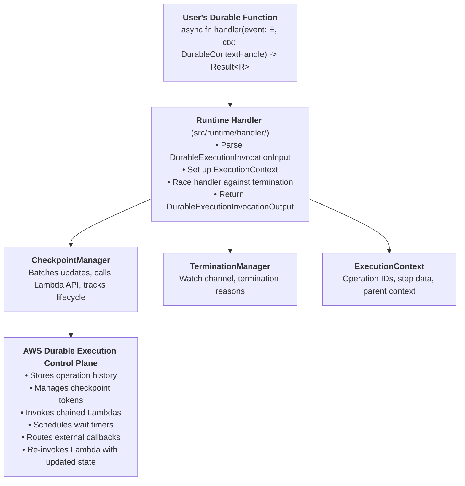

## Execution Lifecycle

### First Invocation

1. AWS control plane invokes Lambda with `DurableExecutionInvocationInput`:
   - `durable_execution_arn`: Unique identifier for this execution
   - `checkpoint_token`: Token for subsequent checkpoint calls
   - `initial_execution_state`: Contains the `Execution` operation with user's input payload

2. Runtime extracts user event from `execution_details.input_payload`

3. User handler runs, calling durable operations (`step`, `wait`, `invoke`, etc.)

4. Each operation:
   - Generates a deterministic ID (hashed from operation name/sequence)
   - Checks if result exists in replay data (it won't on first run)
   - Executes the operation
   - Checkpoints the result to the control plane

5. If handler completes: returns `SUCCEEDED` with result
6. If handler suspends (wait/callback/invoke): returns `PENDING`

### Subsequent Invocations (Replay)

1. Control plane re-invokes Lambda with updated `initial_execution_state` containing all previous operations

2. User handler re-runs **from the beginning**

3. Each operation checks replay data:
   - If `Succeeded`: returns cached result immediately (no re-execution)
   - If `Failed`: returns cached error
   - If `Started`: behavior depends on operation type and semantics (steps with `AtLeastOncePerRetry` re-execute; others suspend)
   - If `Pending`: suspends again (operation still in progress)

4. Handler continues until it hits a new operation or completes

**First Run:**
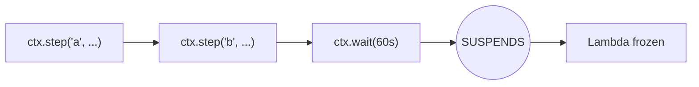

**Second Run (after wait completes):**
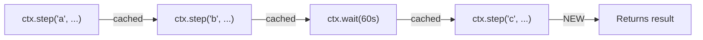

## Core Components

### Runtime Handler (`src/runtime/handler/`)

The entry point wrapping user handlers:

```rust
pub fn with_durable_execution_service<E, R, F, Fut>(
    handler: F,
    config: Option<DurableExecutionConfig>,
) -> impl Service<LambdaEvent<DurableExecutionInvocationInput>, ...>
```

Key mechanism - **racing handler against termination**:

```rust
let result = tokio::select! {
    handler_result = handler_future => {
        Some(handler_result)  // Handler completed
    }
    termination = termination_manager.wait_for_termination() => {
        termination_result = Some(termination);
        None  // Termination triggered
    }
};
```

When an operation needs to suspend (wait, callback, invoke), it:
1. Calls `termination_manager.terminate_for_*()`
2. Awaits `std::future::pending()` to block

The `select!` detects the termination signal and cancels the handler future, allowing the runtime to return `PENDING` gracefully.

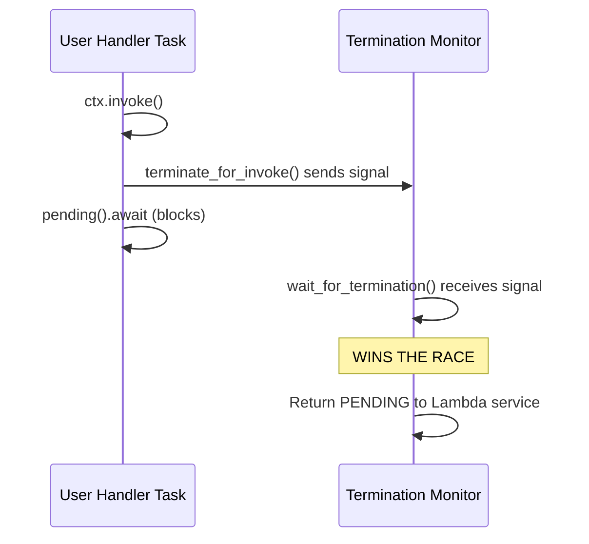

### DurableContextHandle (`src/context/`)

The user-facing API for durable operations:

```rust
impl DurableContextHandle {
    // Core operations
    pub async fn step<F, Fut, T>(&self, name, f, config) -> DurableResult<T>;
    pub async fn wait(&self, name, duration) -> DurableResult<()>;
    pub async fn invoke<I, O>(&self, name, function_id, input) -> DurableResult<O>;

    // Callback operations
    pub async fn wait_for_callback<T, F>(&self, name, submitter, config) -> DurableResult<T>;
    pub async fn create_callback<T>(&self, name, config) -> DurableResult<CallbackHandle<T>>;

    // Batch operations (return BatchResult<T> with per-item status)
    pub async fn parallel<T, F>(&self, name, branches, config) -> DurableResult<BatchResult<T>>;
    pub async fn parallel_named<T, F>(&self, name, branches, config) -> DurableResult<BatchResult<T>>;
    pub async fn map<T, U, F>(&self, name, items, f, config) -> DurableResult<BatchResult<U>>;

    // Condition waiting
    pub async fn wait_for_condition<T, F>(&self, name, check_fn, config) -> DurableResult<T>;

    // Child contexts
    pub async fn run_in_child_context<F, Fut, T>(&self, name, f, config) -> DurableResult<T>;
}
```

Key types:
- `CallbackHandle<T>`: Handle returned by `create_callback`, has `callback_id()` and `wait()` methods
- `BatchResult<T>`: Contains `all: Vec<BatchItem<T>>` with per-item status (`Succeeded`, `Failed`, `Started`), plus helpers like `values()`, `throw_if_error()`, `succeeded()`, `failed()`

Internally wraps `DurableContextImpl` which holds the `ExecutionContext`.

### ExecutionContext (`src/context/execution_context.rs`)

Shared state for a single Lambda invocation:

- `durable_execution_arn`: ARN identifying this execution
- `lambda_service`: AWS Lambda API client
- `checkpoint_manager`: For persisting state
- `termination_manager`: For signaling suspension
- `step_data`: HashMap of hashed operation ID → Operation (replay data)
- `mode`: `Replay` or `Execution`
- `operation_counter`: AtomicU64 for generating unique operation IDs
- `current_parent_id`: Current parent for child context hierarchy
- `pending_completions`: HashSet tracking in-flight operations
- `logger`: DurableLogger for operation logging
- `mode_aware_logging`: Whether to suppress logs during replay

On initialization, if `initial_execution_state.next_marker` is set, the context paginates additional operations via `get_durable_execution_state` API calls.

### CheckpointManager (`src/checkpoint/manager.rs`)

Manages communication with the AWS control plane:

- **Batching**: Queues multiple operations, sends in batches (750KB limit; SDK-parity safeguard, not an AWS-documented quota)
- **Coalescing**: Merges START+SUCCEED for same operation into single update
- **Lifecycle tracking**: Tracks operation states for termination decisions
- **Token management**: Updates checkpoint token after each successful call

```rust
pub async fn checkpoint(&self, step_id: String, update: OperationUpdate) -> DurableResult<()>
```

### TerminationManager (`src/termination/manager.rs`)

Coordinates Lambda suspension using tokio watch channels:

```rust
pub enum TerminationReason {
    RetryScheduled,          // Step retry delay
    WaitScheduled,           // ctx.wait()
    CallbackPending,         // ctx.wait_for_callback()
    InvokePending,           // ctx.invoke()
    CheckpointFailed,        // Unrecoverable checkpoint error
    SerdesFailed,            // Serialization/deserialization error
    ContextValidationError,  // Context validation error
    AllOperationsIdle,       // All operations complete or awaiting
    HandlerCompleted,        // Handler completed successfully
    HandlerFailed,           // Handler failed with error
}
```

When `terminate()` is called:
1. Sets `terminated` flag
2. Invokes checkpoint manager's terminating callback
3. Sends signal via watch channel
4. Runtime's `select!` picks up the signal

## Operation Types

### Step (`src/context/durable_context/step/`)

Executes a closure and checkpoints the result:

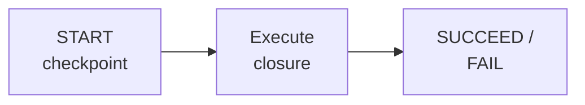

Supports retry strategies (`ExponentialBackoff`, `ConstantDelay`, etc.) with the `RETRY` action.

### Wait (`src/context/durable_context/wait.rs`)

Suspends for a duration:

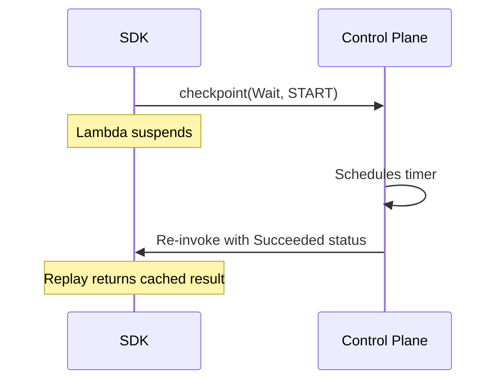

### Callback (`src/context/durable_context/callback.rs`)

Waits for external system to call back:

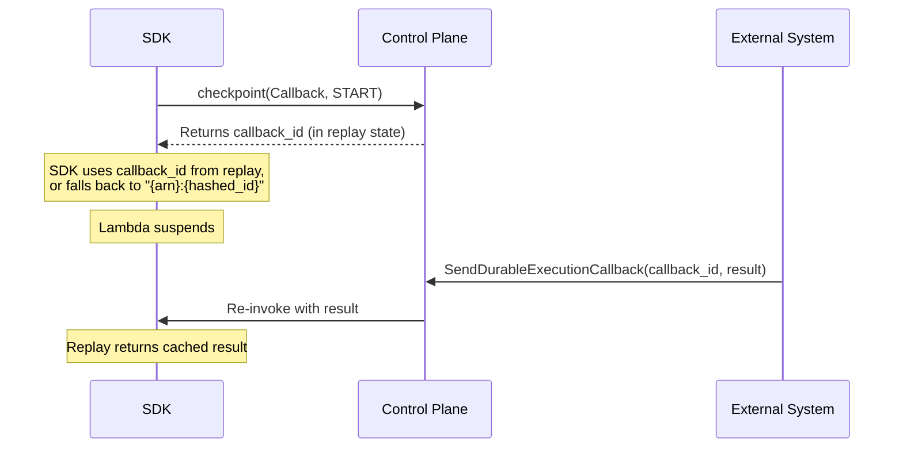

### ChainedInvoke (`src/context/durable_context/invoke/`)

Invokes another Lambda function:

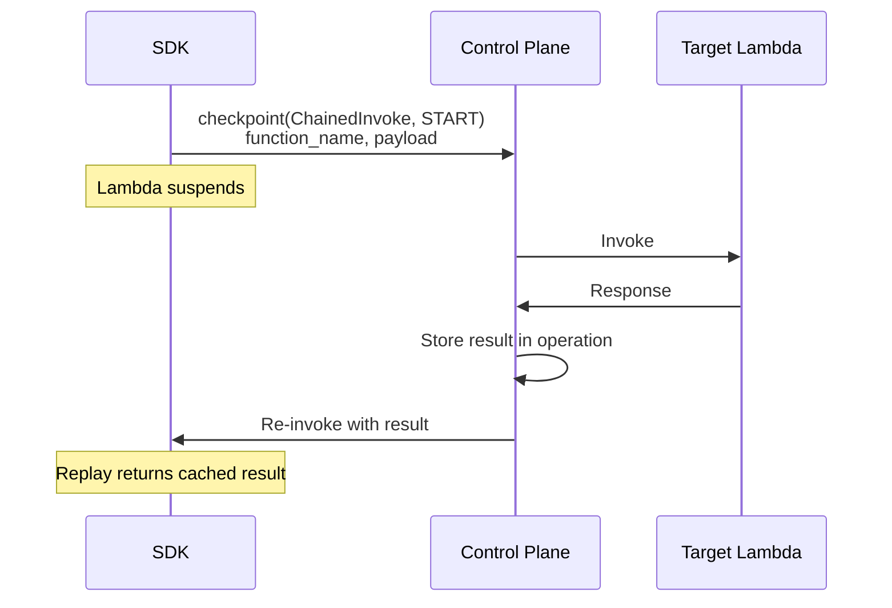

The SDK does **not** invoke the target directly. It checkpoints the intent and suspends. The control plane performs the actual invocation and re-invokes the original Lambda with the result.

### Parallel/Map (`src/context/durable_context/parallel.rs`, `map.rs`)

Executes multiple operations concurrently within a parent context:

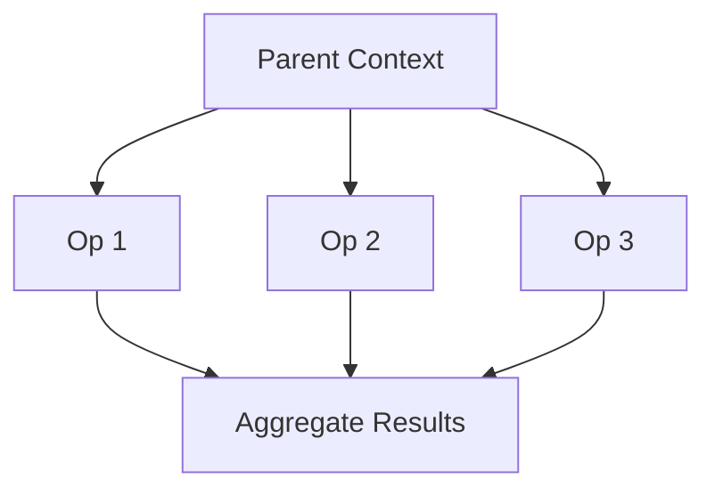

Uses child contexts with `parent_id` to group related operations. Creates `Context` operations for the parent (`sub_type = "Parallel"` or `"Map"`) and each branch/item (`"ParallelBranch"` or `"MapItem"`). See [Context and Execution Operations](#context-and-execution-operations) for details.

### WaitForCondition (`src/context/durable_context/wait_condition/`)

Polls a condition function until a configured strategy signals completion:

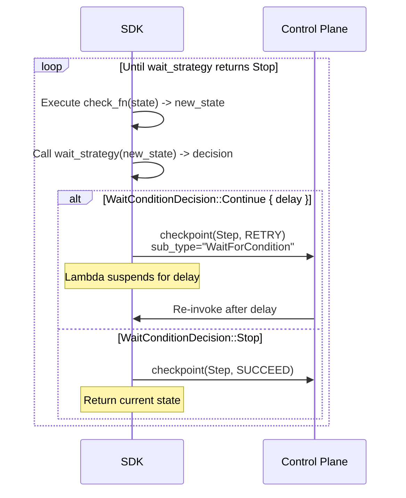

The `check_fn` receives the current state and returns only the updated state. The `WaitConditionDecision` (Continue/Stop) comes from the configured `wait_strategy` function, which inspects the state to decide whether to continue polling. On `Stop`, the final state is returned. Encoded as `OperationType::Step` with `sub_type = "WaitForCondition"`.

### Context and Execution Operations

Two additional operation types:

- **Context**: Used for grouping related operations. Created by:
  - `run_in_child_context` → `sub_type = "RunInChildContext"`
  - `parallel`/`parallel_named` parent → `sub_type = "Parallel"`
  - `parallel` branches → `sub_type = "ParallelBranch"`
  - `map` parent → `sub_type = "Map"`
  - `map` items → `sub_type = "MapItem"`
- **Execution**: The top-level operation representing the entire durable execution. Contains `input_payload` and `output_payload` in `execution_details`.

## Replay Mechanism

### Operation ID Generation

Operations are identified by deterministic hashed IDs:

```rust
// ExecutionContext generates sequential IDs
fn next_operation_id(&self, name: Option<&str>) -> String {
    let counter = self.operation_counter.fetch_add(1, Ordering::SeqCst);
    match name {
        Some(n) => format!("{n}_{counter}"),  // e.g., "step_0", "fetch-data_1"
        None => format!("op_{counter}"),       // e.g., "op_0", "op_1"
    }
}

// CheckpointManager hashes the ID for storage
fn hash_id(id: &str) -> String {
    // SHA-256 hash, truncated to 32 chars
}
```

Parent context is tracked separately in `current_parent_id` and sent as `parent_id` in checkpoint updates. This ensures the same operation gets the same ID across invocations, as long as the handler is deterministic.

### Replay Flow

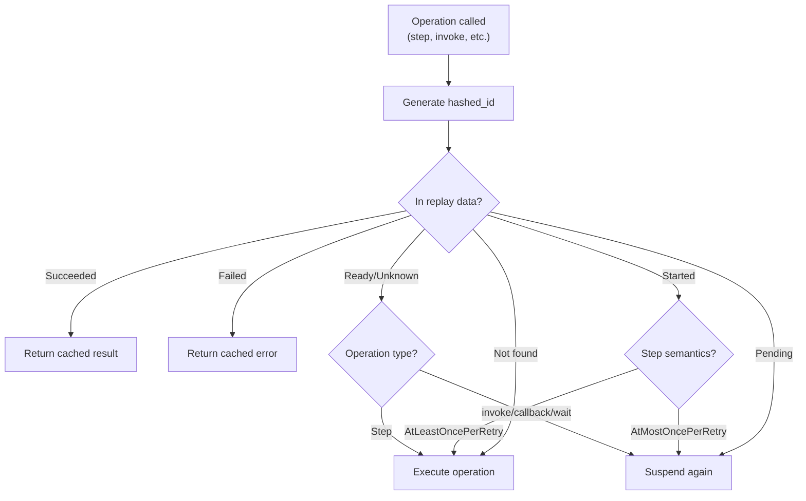

Operation statuses: `Ready`, `Started`, `Pending`, `Succeeded`, `Failed`, `Unknown`

```rust
// In each operation (e.g., step, invoke):
let hashed_id = Self::hash_id(&step_id);

// Check replay data
if let Some(operation) = self.execution_ctx.get_step_data(&hashed_id).await {
    match operation.status {
        OperationStatus::Succeeded => {
            // Return cached result
            return Ok(deserialize(operation.details.result));
        }
        OperationStatus::Failed => {
            // Return cached error
            return Err(operation.details.error);
        }
        OperationStatus::Ready | OperationStatus::Unknown => {
            // For steps: proceed to execute
            // For invoke/callback/wait: suspend
        }
        OperationStatus::Started => {
            // For steps: depends on StepSemantics
            //   AtLeastOncePerRetry: re-execute (default)
            //   AtMostOncePerRetry: suspend and wait
            // For invoke/callback/wait: always suspend
        }
        OperationStatus::Pending => {
            // Always suspend - operation in progress
        }
    }
}

// Not in replay - execute normally
execute_operation().await
```

### Determinism Requirements

For replay to work correctly, handlers must be deterministic:

**DO:**
- Use `ctx.step()` for any side effects
- Use the same operation names in the same order
- Pass inputs via the event, not external state

**DON'T:**
- Use `rand()` or `Uuid::new_v4()` outside of steps
- Branch on current time outside of steps
- Read external state that might change between invocations

## Checkpoint Protocol

### OperationUpdate Structure

```rust
pub struct OperationUpdate {
    pub id: String,                    // Hashed operation ID
    pub parent_id: Option<String>,     // For child contexts
    pub name: Option<String>,          // User-provided name
    pub operation_type: OperationType, // Step, Wait, Callback, ChainedInvoke, Context, Execution
    pub sub_type: Option<String>,      // e.g., "WaitForCondition", "Parallel", "Map", "Callback"
    pub action: OperationAction,       // Start, Succeed, Fail, Retry, Cancel
    pub payload: Option<String>,       // Result JSON
    pub error: Option<ErrorObject>,    // Error details

    // Type-specific options
    pub step_options: Option<StepUpdateOptions>,
    pub wait_options: Option<WaitUpdateOptions>,
    pub callback_options: Option<CallbackUpdateOptions>,
    pub chained_invoke_options: Option<ChainedInvokeUpdateOptions>,
    pub context_options: Option<ContextUpdateOptions>,
}
```

Operation types:
- `Step`: Regular step execution, also used for `wait_for_condition` (with `sub_type = "WaitForCondition"`)
- `Wait`: Time-based wait
- `Callback`: External callback
- `ChainedInvoke`: Lambda invocation
- `Context`: Grouping operation for child contexts. Sub-types: `"RunInChildContext"`, `"Parallel"`, `"ParallelBranch"`, `"Map"`, `"MapItem"`
- `Execution`: Top-level execution operation

### Checkpoint Flow

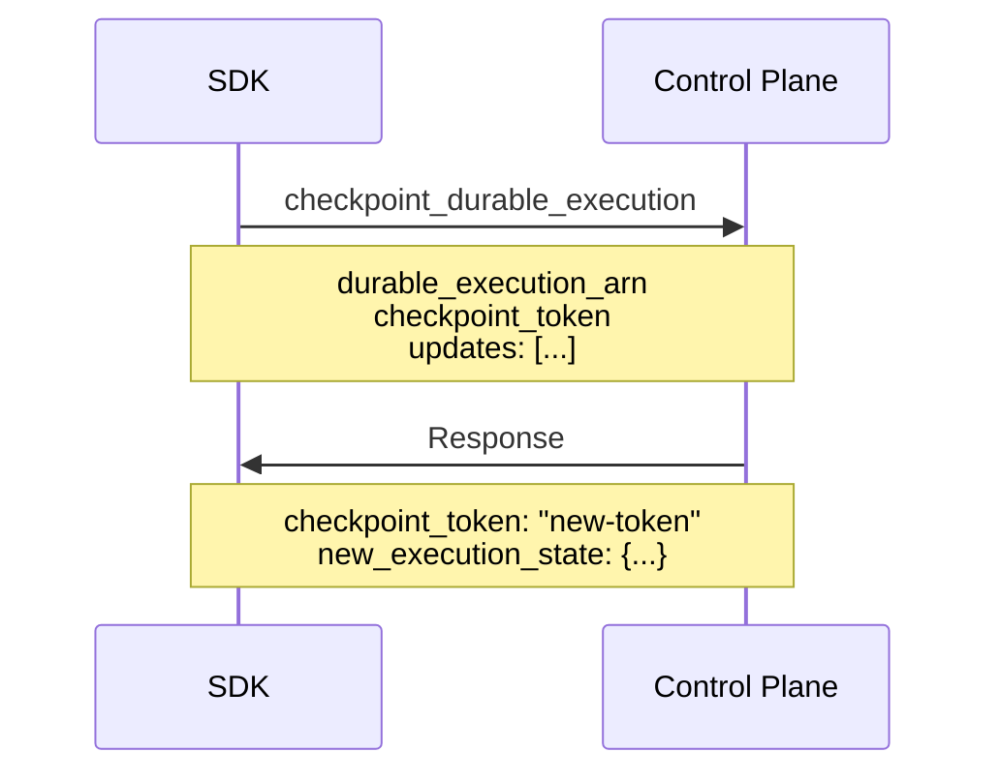

The SDK must use the new `checkpoint_token` for subsequent calls.

## Error Handling

### DurableError Categories

```rust
pub enum DurableError {
    // Recoverable - will retry
    CheckpointFailed { recoverable: true, ... },

    // Non-recoverable - execution fails
    StepFailed { ... },
    InvocationFailed { ... },
    Internal(String),

    // Validation errors
    ContextValidationError { ... },
}
```

### Termination on Errors

Certain errors trigger immediate termination:

1. **Checkpoint failure** → `TerminationReason::CheckpointFailed` → Lambda error
2. **Serialization failure** → `TerminationReason::SerdesFailed` → Lambda error
3. **Context validation** → `TerminationReason::ContextValidationError` → Failed output

## Module Structure

```
src/
├── lib.rs                     # Public API, prelude
├── context/
│   ├── mod.rs
│   ├── execution_context.rs   # Shared invocation state
│   ├── step_context.rs        # StepContext for step closures
│   └── durable_context/
│       ├── mod.rs             # DurableContextHandle, DurableContextImpl, CallbackHandle
│       ├── batch.rs           # Batch result building helpers
│       ├── serdes.rs          # Serialization helpers
│       ├── step.rs            # ctx.step() - delegates to step/
│       ├── step/
│       │   ├── execute.rs     # Step execution logic
│       │   └── replay.rs      # Step replay logic
│       ├── wait.rs            # ctx.wait() - delegates to wait/
│       ├── wait/
│       │   └── execute.rs
│       ├── wait_condition.rs  # ctx.wait_for_condition()
│       ├── wait_condition/
│       │   ├── execute.rs
│       │   └── replay.rs
│       ├── callback.rs        # ctx.wait_for_callback(), ctx.create_callback()
│       ├── callback/
│       │   ├── execute.rs
│       │   └── replay.rs
│       ├── invoke.rs          # ctx.invoke()
│       ├── invoke/
│       │   ├── execute.rs
│       │   └── replay.rs
│       ├── parallel.rs        # ctx.parallel(), ctx.parallel_named()
│       ├── parallel/
│       │   ├── execute.rs
│       │   └── replay.rs
│       ├── map.rs             # ctx.map()
│       ├── map/
│       │   ├── execute.rs
│       │   └── replay.rs
│       ├── child.rs           # ctx.run_in_child_context()
│       └── child/
│           ├── execute.rs
│           └── replay.rs
├── checkpoint/
│   ├── mod.rs
│   ├── manager.rs             # CheckpointManager (main file, includes submodules)
│   └── manager/
│       ├── coalesce.rs        # Update coalescing logic
│       ├── lifecycle.rs       # Operation lifecycle tracking
│       ├── queue.rs           # Batch queue processing
│       └── hash.rs            # ID hashing
├── termination/
│   ├── mod.rs
│   └── manager.rs             # TerminationManager
├── runtime/
│   ├── handler.rs             # with_durable_execution_service, durable_handler
│   └── handler/
│       └── execute.rs         # Core execution logic
├── retry/
│   ├── mod.rs                 # RetryStrategy trait
│   ├── strategy.rs            # ExponentialBackoff, ConstantDelay, etc.
│   └── presets.rs             # Common configurations
├── types/
│   ├── mod.rs
│   ├── invocation.rs          # Input/Output types, Operation, OperationStatus
│   ├── lambda_service.rs      # LambdaService trait, RealLambdaService
│   ├── batch.rs               # BatchResult, BatchItem, BatchItemStatus
│   ├── duration.rs            # Duration wrapper
│   ├── logger.rs              # DurableLogger trait, TracingLogger
│   ├── serdes.rs              # Serdes trait for custom serialization
│   └── config/
│       ├── mod.rs
│       ├── step.rs            # StepConfig, StepSemantics
│       ├── callback.rs        # CallbackConfig
│       ├── invoke.rs          # InvokeConfig
│       ├── parallel.rs        # ParallelConfig
│       ├── map.rs             # MapConfig
│       ├── child.rs           # ChildContextConfig
│       ├── wait_condition.rs  # WaitConditionConfig, WaitConditionDecision
│       ├── completion.rs      # CompletionConfig for batch operations
│       └── durable_execution.rs  # DurableExecutionConfig
└── error/
    ├── mod.rs
    └── types.rs               # DurableError, ErrorObject
```

## Testing

The SDK provides mock implementations for testing:

```rust
use lambda_durable_execution_rust::mock::{MockLambdaService, MockCheckpointConfig};

let mock = Arc::new(MockLambdaService::new());
mock.expect_checkpoint(MockCheckpointConfig {
    checkpoint_token: Some("token-1".to_string()),
    operations: vec![...],
    ..Default::default()
});

let config = DurableExecutionConfig::new()
    .with_lambda_service(mock);
```

This allows testing handler logic without actual AWS calls.
