# Durable Execution Examples (Rust)

This directory is a standalone Cargo package (`examples/Cargo.toml`) containing deployable AWS Lambda functions that exercise `lambda-durable-execution-rust`. Each example is also validated end-to-end by `examples/scripts/validate.py`, which invokes the deployed functions and generates diagrams from the returned durable execution history.

## Deploy

Prereqs:
- AWS credentials configured (e.g. `aws configure`) and permission to deploy Lambda/SAM + Durable Execution.
- AWS SAM CLI with the Rust `rust-cargolambda` build method enabled (preview).
- `uv` (for running the validator script); for SVG rendering: `playwright install chromium`.

Build and deploy to `us-east-1`:
```bash
sam build -t examples/template.yaml --beta-features
sam deploy -t examples/template.yaml --guided --region us-east-1 --stack-name durable-rust
```

## Validate & regenerate diagrams

Run all deployed examples, save artifacts under `examples/.durable-validation`, and regenerate Mermaid + SVG diagrams under `examples/diagrams/`:
```bash
playwright install chromium
uv run examples/scripts/validate.py \
  --region us-east-1 \
  --stack durable-rust \
  --out examples/.durable-validation \
  --diagrams-out examples/diagrams \
  --mermaid --svg \
  --timeout-seconds 240
```

Notes:
- The Mermaid is generated from the real durable execution history, so node ids may change between runs.
- The SVG files are derived from the Mermaid using `mermaid-cli` (via Playwright).

## Examples

### Hello World (`hello_world`)

A minimal typed workflow: a deterministic `ctx.step()` computes the input name length and then `ctx.wait()` suspends for 10 seconds (so the suspend/resume behavior is easy to see in history). The handler returns a typed JSON response.

- Source: [`src/bin/hello_world/main.rs`](src/bin/hello_world/main.rs)
- Diagram (SVG): [`diagrams/hello_world.svg`](diagrams/hello_world.svg)

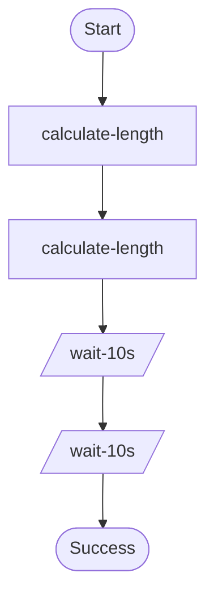
---
### Callback / external approval (`callback_example`)

Shows `ctx.wait_for_callback()` for external coordination. The workflow submits an approval request (the “submitter” step) and then suspends until the callback is completed; `examples/scripts/validate.py` completes it using the Lambda callback APIs.

- Source: [`src/bin/callback_example/main.rs`](src/bin/callback_example/main.rs)
- Diagram (SVG): [`diagrams/callback_example.svg`](diagrams/callback_example.svg)

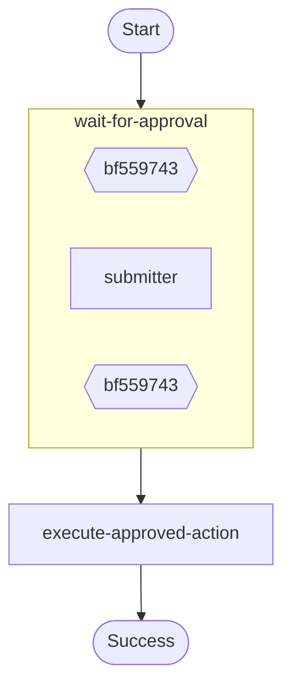
---
### Step retry (`step_retry`)

Demonstrates a `StepConfig` with an `ExponentialBackoff` retry strategy. Retry decisions and the scheduled delays are durable (checkpointed), so a replay resumes with the same retry schedule.

- Source: [`src/bin/step_retry/main.rs`](src/bin/step_retry/main.rs)
- Diagram (SVG): [`diagrams/step_retry.svg`](diagrams/step_retry.svg)

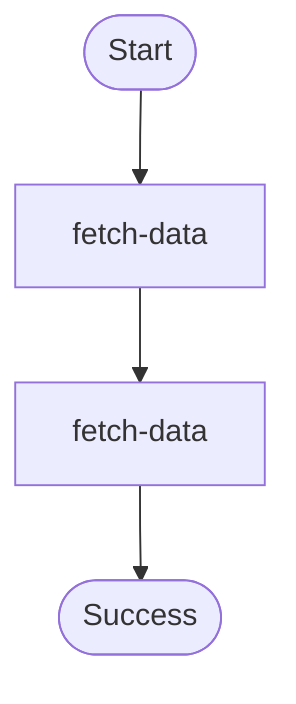
---
### Child context (“scoped workflow”) (`child_context`)

Uses `ctx.run_in_child_context()` to group a set of related steps under a single parent operation (“batch-processing-context”). This is useful for structuring workflows and keeping operation names scoped in the execution history.

- Source: [`src/bin/child_context/main.rs`](src/bin/child_context/main.rs)
- Diagram (SVG): [`diagrams/child_context.svg`](diagrams/child_context.svg)

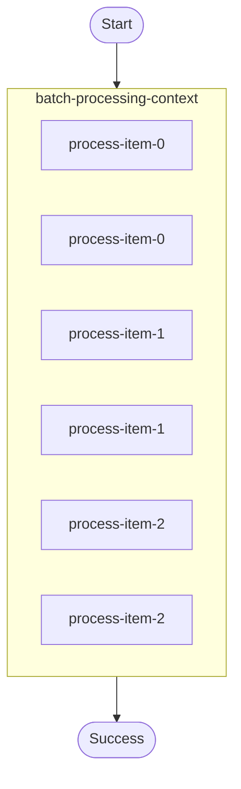
---
### Map (bounded concurrency) (`map_operations`)

Illustrates `ctx.map()` for fan-out over a list of items with per-item durable steps. The example uses `MapConfig::with_max_concurrency(2)` to limit in-flight work.

- Source: [`src/bin/map_operations/main.rs`](src/bin/map_operations/main.rs)
- Diagram (SVG): [`diagrams/map_operations.svg`](diagrams/map_operations.svg)

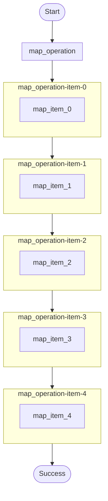
---
### Parallel fan-out (`parallel`)

Uses `ctx.parallel()` to fan out into multiple concurrent branches and gather their results. `ParallelConfig::with_max_concurrency(2)` bounds concurrency, and one branch includes a durable wait to show that waits are replay-safe across suspends.

- Source: [`src/bin/parallel/main.rs`](src/bin/parallel/main.rs)
- Diagram (SVG): [`diagrams/parallel.svg`](diagrams/parallel.svg)

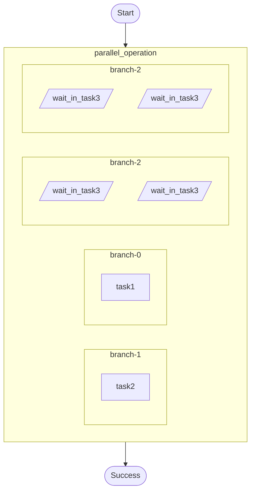
--
### Parallel "first successful" (`parallel_first_successful`)

Runs several branches concurrently but returns as soon as any branch succeeds using `CompletionConfig::with_min_successful(1)`. This pattern is useful for racing alternative strategies and keeping the fastest successful result.

- Source: [`src/bin/parallel_first_successful/main.rs`](src/bin/parallel_first_successful/main.rs)
- Diagram (SVG): [`diagrams/parallel_first_successful.svg`](diagrams/parallel_first_successful.svg)

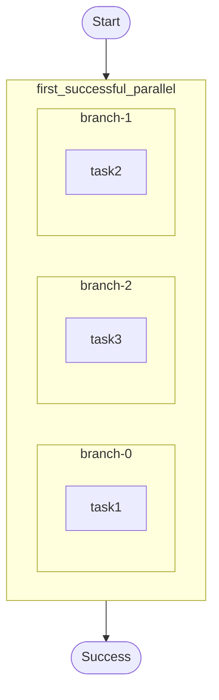
---
### Map with failure tolerance (`map_with_failure_tolerance`)

Shows `ctx.map()` with `CompletionConfig::with_tolerated_failures(3)` so the batch can complete even if a few items fail. In this example, items divisible by 3 fail and are recorded in the batch result instead of aborting the workflow.

- Source: [`src/bin/map_with_failure_tolerance/main.rs`](src/bin/map_with_failure_tolerance/main.rs)
- Diagram (SVG): [`diagrams/map_with_failure_tolerance.svg`](diagrams/map_with_failure_tolerance.svg)

```mermaid
flowchart TD
    n_46b16856_df65_3f_start([Start])
    subgraph n_93472deddf9066f9["map_with_tolerance"]
    end
    subgraph n_a900ee0ac6c58756["map_with_tolerance-item-0"]
        n_236eca427148f2df_Step_8["item_0"]
    end
    subgraph n_6e39ce714e6dbf50["map_with_tolerance-item-3"]
        n_58dcf0d91ecf5848_Step_9["item_3"]
    end
    subgraph n_27ec189e482d9946["map_with_tolerance-item-4"]
        n_f8e280267e20521e_Step_10["item_4"]
    end
    subgraph n_bda33116c97db9be["map_with_tolerance-item-1"]
        n_cd10f8b76ba8eb9b_Step_11["item_1"]
    end
    subgraph n_91d91fd2f4d7654f["map_with_tolerance-item-2"]
        n_b8fdde29fcc63e7b_Step_12["item_2"]
    end
    subgraph n_9ba8d1a73d5afb19["map_with_tolerance-item-5"]
        n_5b4bdd4b632c03fa_Step_23["item_5"]
    end
    subgraph n_84ba9b450c25a759["map_with_tolerance-item-6"]
        n_7c80051c41d4ae47_Step_24["item_6"]
    end
    subgraph n_91c789da0a3e2798["map_with_tolerance-item-7"]
        n_7b8907a1ad2cf9a0_Step_25["item_7"]
    end
    subgraph n_2694e95ed13905a6["map_with_tolerance-item-8"]
        n_1bf94bf2f8778b16_Step_26["item_8"]
    end
    subgraph n_f8dfeaeed0c96d54["map_with_tolerance-item-9"]
        n_026756bd0bde5d4b_Step_27["item_9"]
    end
    n_46b16856_df65_3f_end([Success])
    n_46b16856_df65_3f_start --> n_93472deddf9066f9 --> n_a900ee0ac6c58756 --> n_6e39ce714e6dbf50 --> n_27ec189e482d9946 --> n_bda33116c97db9be --> n_91d91fd2f4d7654f --> n_9ba8d1a73d5afb19 --> n_84ba9b450c25a759 --> n_91c789da0a3e2798 --> n_2694e95ed13905a6 --> n_f8dfeaeed0c96d54 --> n_46b16856_df65_3f_end
```
---
### Wait-for-condition (polling) (`wait_for_condition`)

Demonstrates `ctx.wait_for_condition()` to poll state until a stop condition is reached. The step increments a counter, and the decision function returns `Continue { delay }` to suspend between polls.

- Source: [`src/bin/wait_for_condition/main.rs`](src/bin/wait_for_condition/main.rs)
- Diagram (SVG): [`diagrams/wait_for_condition.svg`](diagrams/wait_for_condition.svg)

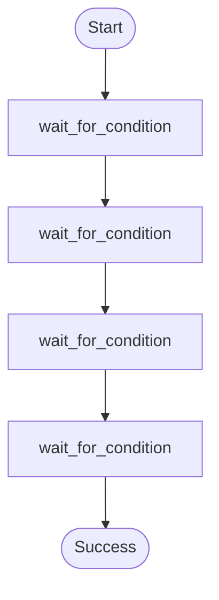
---
### Map with custom item Serdes (`map_with_custom_serdes`)

Shows how to attach an item-level `Serdes` to `ctx.map()` so each per-item result uses custom serialization/deserialization logic (useful for versioning or interop with existing payload formats). The example returns a JSON summary of the processed items.

- Source: [`src/bin/map_with_custom_serdes/main.rs`](src/bin/map_with_custom_serdes/main.rs)
- Diagram (SVG): [`diagrams/map_with_custom_serdes.svg`](diagrams/map_with_custom_serdes.svg)

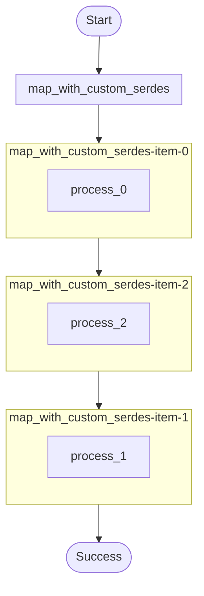
---
### Wait-for-callback with heartbeat timeout (`wait_for_callback_heartbeat`)

Demonstrates configuring `CallbackConfig` with both a total timeout and a heartbeat timeout. The workflow suspends in `ctx.wait_for_callback()` until the callback is completed (the validator completes it), and the timeouts protect against forgotten callbacks.

- Source: [`src/bin/wait_for_callback_heartbeat/main.rs`](src/bin/wait_for_callback_heartbeat/main.rs)
- Diagram (SVG): [`diagrams/wait_for_callback_heartbeat.svg`](diagrams/wait_for_callback_heartbeat.svg)

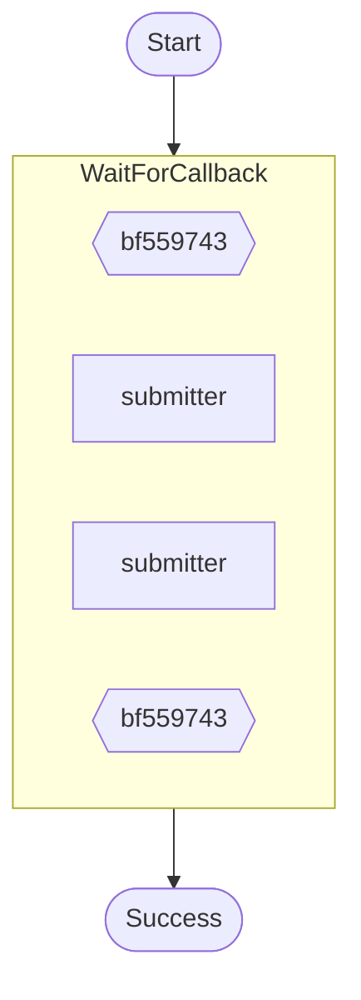

---
### Multiple callbacks in one workflow (`wait_for_callback_multiple_invocations`)

Executes two `ctx.wait_for_callback()` operations sequentially, with durable waits and a step in between. This illustrates how callback ids and completions are scoped and recorded across multiple external interactions.

- Source: [`src/bin/wait_for_callback_multiple_invocations/main.rs`](src/bin/wait_for_callback_multiple_invocations/main.rs)
- Diagram (SVG): [`diagrams/wait_for_callback_multiple_invocations.svg`](diagrams/wait_for_callback_multiple_invocations.svg)

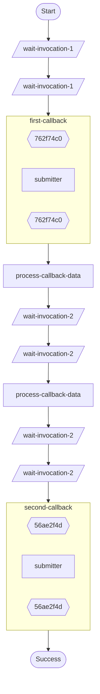

---
### Nested child contexts ("blocks") (`block_example`)

Shows nested `ctx.run_in_child_context()` calls to build a parent/child hierarchy in the workflow history. This pattern is useful for grouping operations (and their steps/waits) under meaningful names.

- Source: [`src/bin/block_example/main.rs`](src/bin/block_example/main.rs)
- Diagram (SVG): [`diagrams/block_example.svg`](diagrams/block_example.svg)

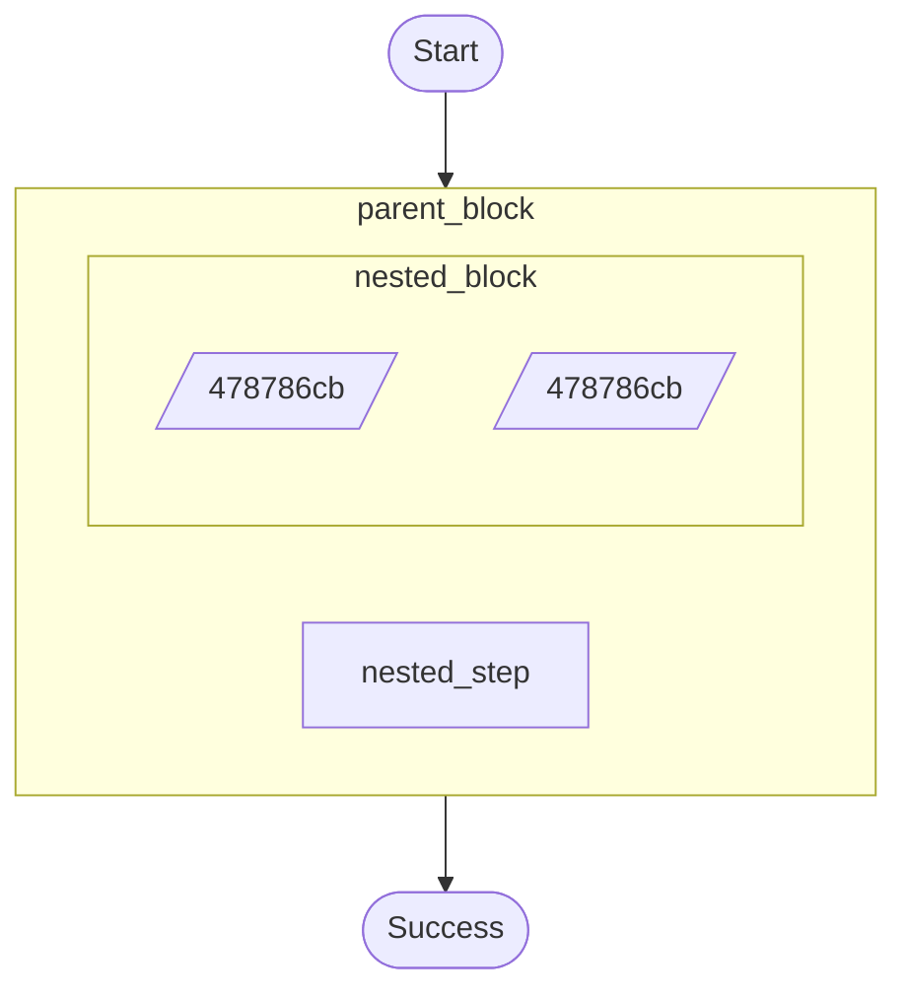
---
### Durable invoke target (`invoke_target`)

A small durable workflow intended to be called by another workflow via `ctx.invoke()`. It performs work inside a checkpointed `ctx.step()` and returns a typed response.

- Source: [`src/bin/invoke_target/main.rs`](src/bin/invoke_target/main.rs)
- Diagram (SVG): [`diagrams/invoke_target.svg`](diagrams/invoke_target.svg)

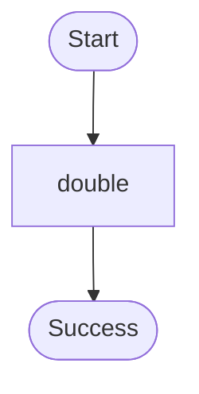

---
### Durable invoke caller (`invoke_caller`)

Demonstrates `ctx.invoke()` as a durable operation: the workflow invokes `invoke_target` (configured via `INVOKE_TARGET_FUNCTION` in the SAM template), then uses the returned value in a follow-up step.

- Source: [`src/bin/invoke_caller/main.rs`](src/bin/invoke_caller/main.rs)
- Diagram (SVG): [`diagrams/invoke_caller.svg`](diagrams/invoke_caller.svg)

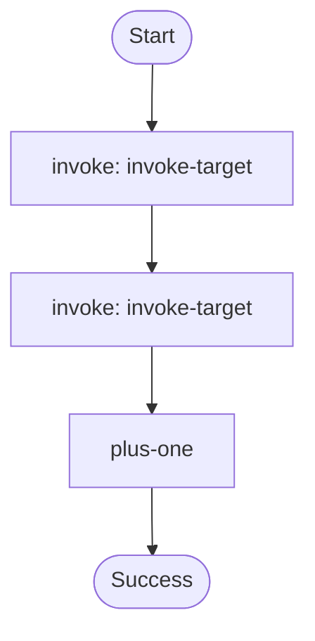
