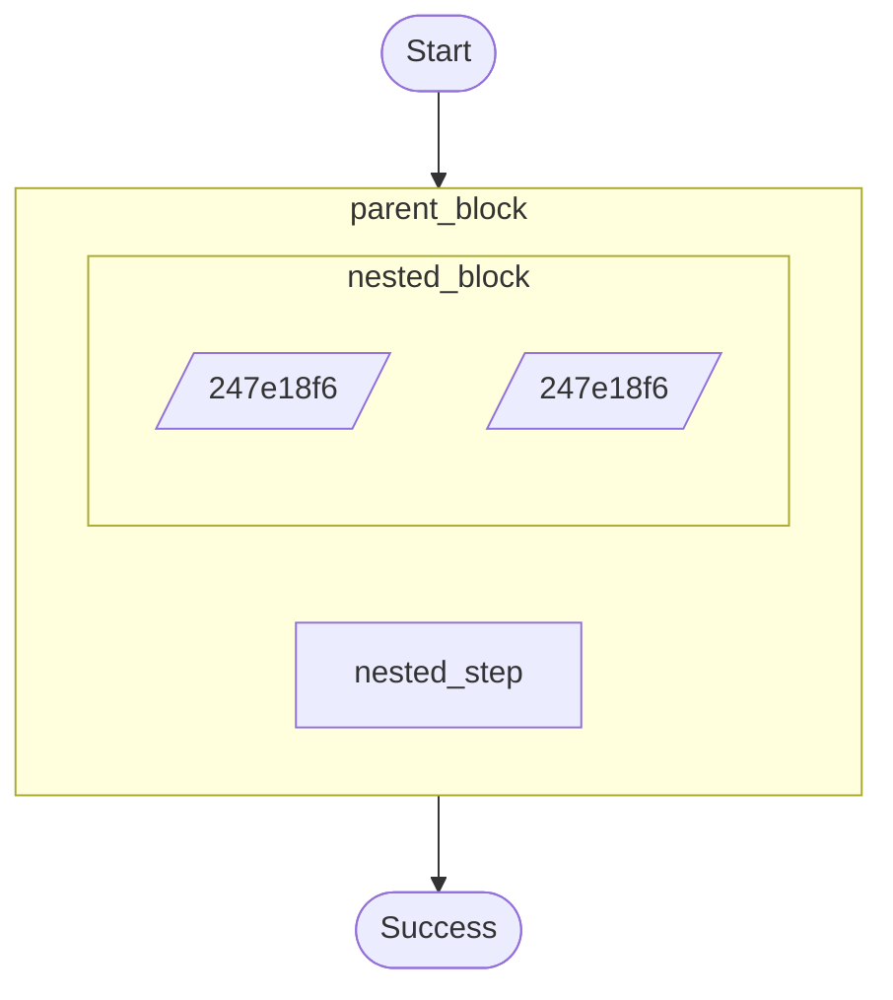

# Nested child contexts (“blocks”) example.

Demonstrates:
- `ctx.run_in_child_context()` nesting and parent/child operation hierarchy.
- Mixing steps and waits inside nested contexts.

Source: `../src/bin/block_example/main.rs`

