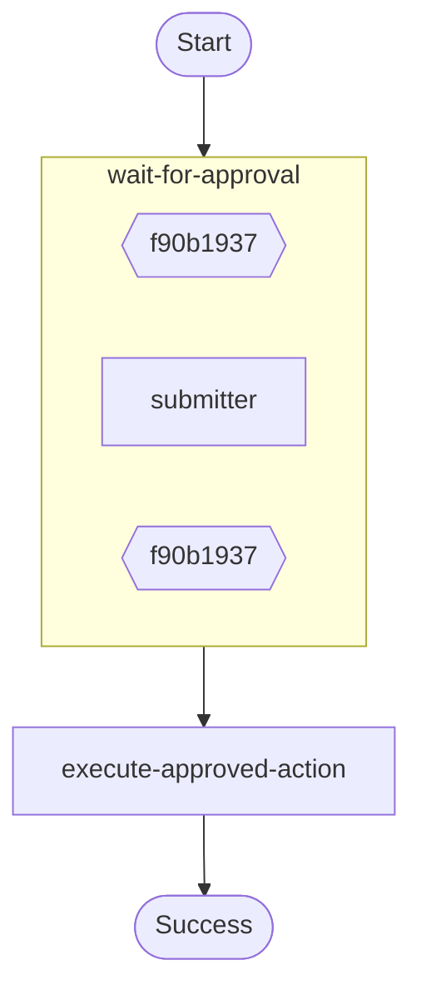

# Durable callback (external approval) workflow.

Demonstrates:
- `ctx.wait_for_callback()` to suspend until an external system completes a callback.
- A “submitter” step that would normally notify a human/system with the callback id.

Source: `../src/bin/callback_example/main.rs`

