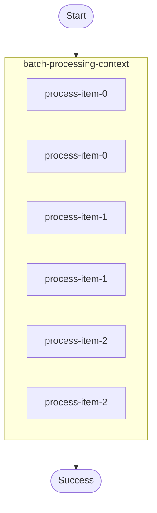

# Child context (“scoped workflow”) example.

Demonstrates:
- `ctx.run_in_child_context()` to group a set of steps under a single parent operation.
- A simple sequential “batch processing” loop inside a child context.

Source: `../src/bin/child_context/main.rs`

