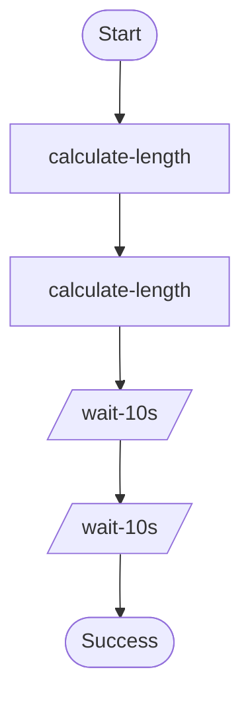

# Hello World durable workflow.

Demonstrates:
- `ctx.step()` for deterministic, checkpointed work.
- `ctx.wait()` to suspend/resume without paying for idle compute.

Source: `../src/bin/hello_world/main.rs`

