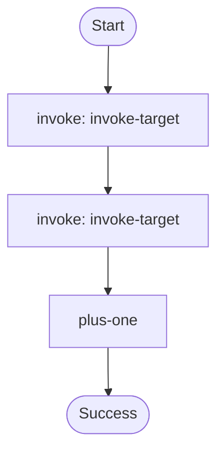

# Durable invoke caller example.

Demonstrates:
- `ctx.invoke()` to call another Lambda function as a durable operation.
- Passing a typed payload to the target and using the typed result in a follow-up step.

Source: `../src/bin/invoke_caller/main.rs`

