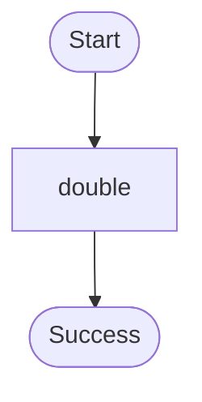

# Durable invoke target example.

Demonstrates:
- A simple durable function designed to be called via `ctx.invoke()` from another workflow.
- Performing work inside a checkpointed `ctx.step()`.

Source: `../src/bin/invoke_target/main.rs`

