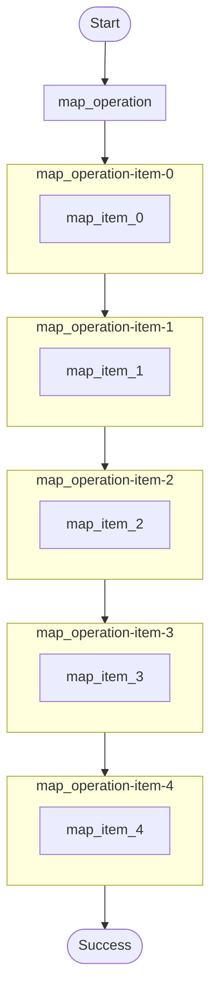

# Map fan-out (bounded concurrency) example.

Demonstrates:
- `ctx.map()` to process a list of items with per-item durable steps.
- `MapConfig::with_max_concurrency()` to limit in-flight work.

Source: `../src/bin/map_operations/main.rs`

