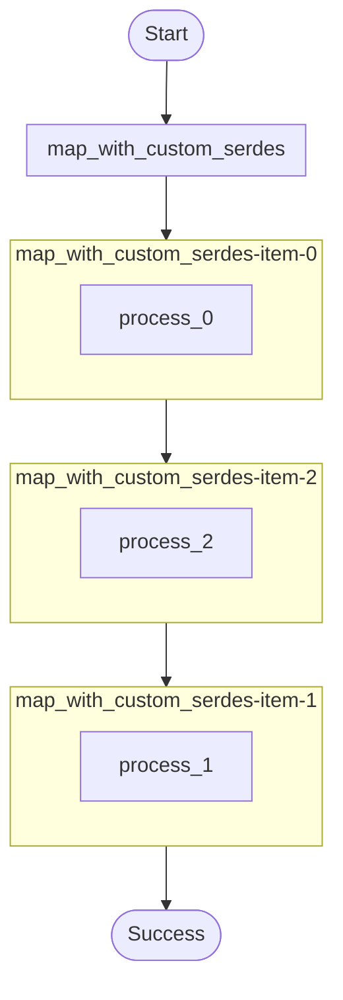

# Map fan-out with custom Serdes example.

Demonstrates:
- Supplying an `item_serdes` to `ctx.map()` so each item result is serialized/deserialized with custom logic.
- Returning a JSON summary of per-item processing.

Source: `../src/bin/map_with_custom_serdes/main.rs`

