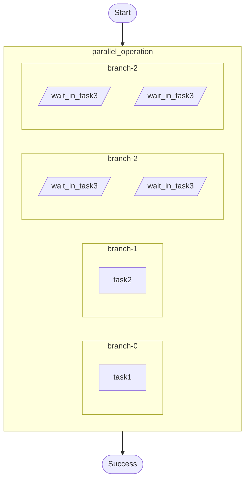

# Parallel fan-out (bounded concurrency) example.

Demonstrates:
- `ctx.parallel()` to run multiple branches concurrently (each branch uses durable ops).
- `ParallelConfig::with_max_concurrency()` to bound in-flight branches.

Source: `../src/bin/parallel/main.rs`

