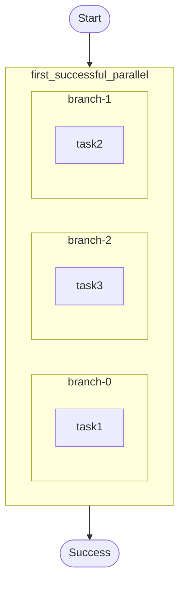

# Parallel early-completion (“first successful”) example.

Demonstrates:
- `ctx.parallel()` with `CompletionConfig::with_min_successful(1)` to return once any branch succeeds.
- Collecting the first successful branch result from the batch.

Source: `../src/bin/parallel_first_successful/main.rs`

