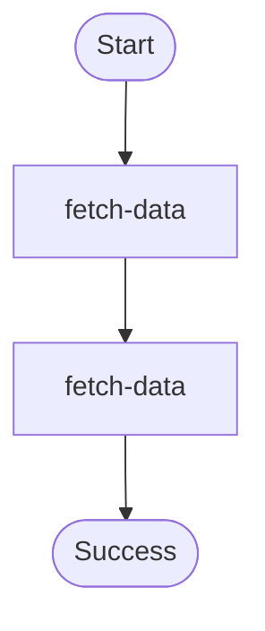

# Step retries (exponential backoff) workflow.

Demonstrates:
- `StepConfig` + `ExponentialBackoff` retry strategy for transient failures.
- Durable retries: retry decisions and scheduled delays are checkpointed.

Source: `../src/bin/step_retry/main.rs`

