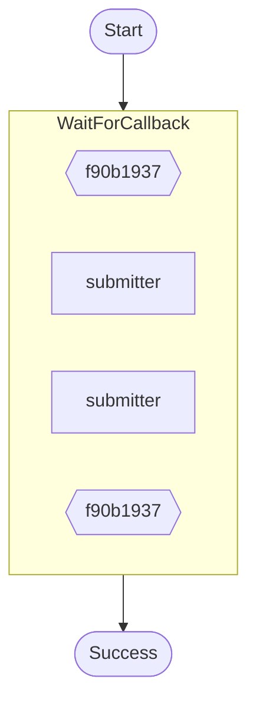

# Wait-for-callback with heartbeat timeout example.

Demonstrates:
- `ctx.wait_for_callback()` with both a total timeout and a heartbeat timeout.
- Suspending until the callback is completed (or times out).

Source: `../src/bin/wait_for_callback_heartbeat/main.rs`

