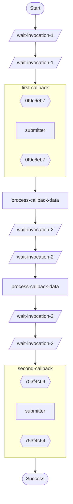

# Multiple callbacks in one workflow example.

Demonstrates:
- Two sequential `ctx.wait_for_callback()` operations, separated by other durable ops.
- Durable waits between invocations to make the state machine visible in history.

Source: `../src/bin/wait_for_callback_multiple_invocations/main.rs`

