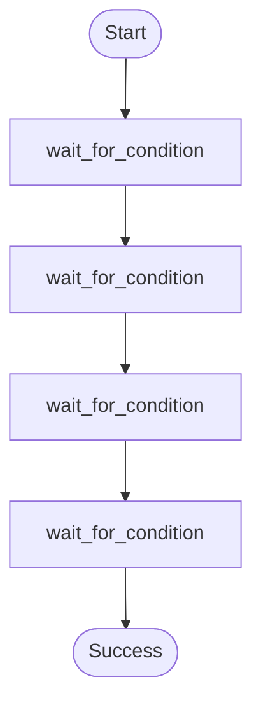

# Wait-for-condition (polling) example.

Demonstrates:
- `ctx.wait_for_condition()` to repeatedly run a step until a stop condition is reached.
- Returning `WaitConditionDecision::Continue { delay }` to suspend between polls.

Source: `../src/bin/wait_for_condition/main.rs`

